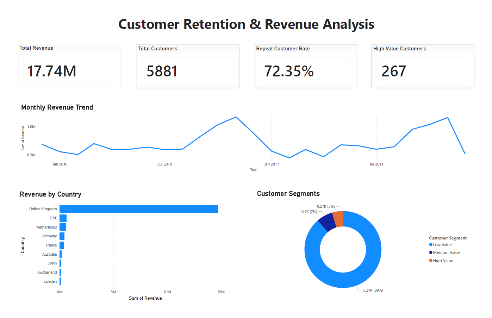

# Customer Retention & Revenue Analysis

## Project Overview
This project analyses retail transaction data to identify customer retention patterns, revenue trends and high-value customer segments using SQL and Power BI.

The project focuses on transforming raw transactional retail data into meaningful business insights and presenting them through a professional business dashboard.

---

## Tools & Technologies
- PostgreSQL
- pgAdmin 4
- Power BI
- DAX
- Power Query

---

## Data Source

Dataset: Online Retail II Data Set from ML Repository  
Source: Kaggle  
Original source: UCI Machine Learning Repository  
Link: https://www.kaggle.com/datasets/mathchi/online-retail-ii-data-set-from-ml-repository  

The dataset contains transactions from a UK-based online retailer between 01/12/2009 and 09/12/2011.

---

## Licence

This dataset is licensed under the Open Data Commons Open Database License (ODbL) v1.0.

Licence details:
https://opendatacommons.org/licenses/dbcl/1-0/

---

## Project Workflow

### 1. Data Cleaning
- Removed cancelled transactions
- Removed rows containing missing customer IDs
- Created revenue calculation field
- Standardised and validated data types

### 2. SQL Analysis
- Calculated total revenue
- Identified repeat customers
- Calculated repeat customer rate
- Analysed top customers by revenue
- Performed customer segmentation
- Analysed revenue by country
- Analysed monthly revenue trends

### 3. Power BI Dashboard Development
- Imported cleaned dataset into Power BI
- Created DAX measures for KPI calculations
- Designed KPI summary cards
- Built trend and segmentation visuals
- Applied dashboard formatting and layout improvements

### 4. Business Insights
- Identified strong customer retention patterns
- Highlighted the importance of high-value customers
- Identified geographic revenue concentration
- Visualised seasonal revenue trends

---

## Key Business Questions
- What is the total revenue generated?
- What percentage of customers are repeat customers?
- Which customers generate the highest revenue?
- Which countries generate the most revenue?
- How does revenue change over time?
- How are customers distributed across customer value segments?

---

## Dashboard Features
- KPI cards for key business metrics
- Monthly revenue trend analysis
- Revenue by country visualisation
- Customer segmentation analysis
- High-value customer identification

---

## Dashboard

---

## Skills Demonstrated
- Data cleaning
- SQL querying
- Customer retention analysis
- Revenue analysis
- DAX measures
- Dashboard design
- Business data storytelling
